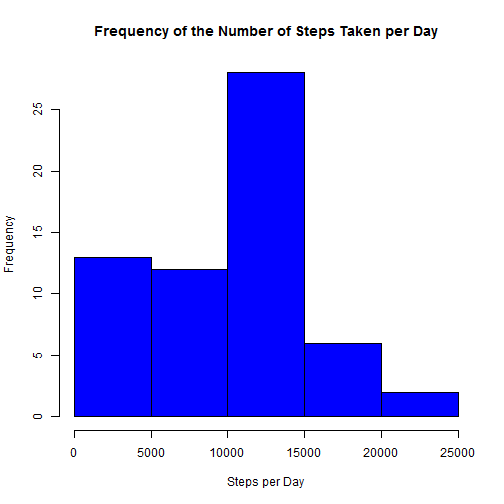
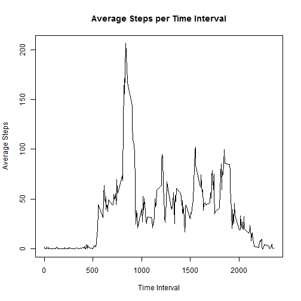
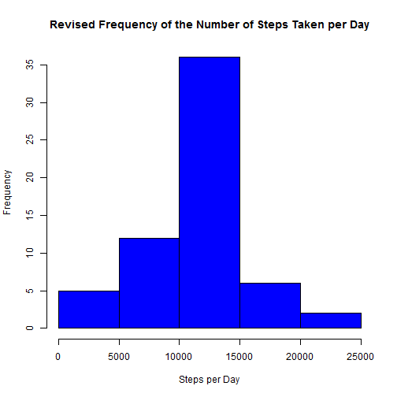
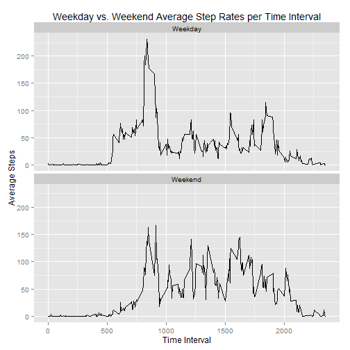

#Reproducible Research Project 1

##Introduction

This first project in the Reproducible Research course looks to evaluate a data 
set obtained from an activity monitor (such as Fitbit, Nike Fuelband, or other similar device) over the course of a to month period.  The data set contains three recorded variables:

     - Steps:  The number of steps taken during a given 5 minute interval.
     - Date:   The date on which the measurement was taken.
     - Interval:    Identifier for the 5-minute interval during the day in which  
                    the measurement was taken. 

Please note that the data set was manually downloaded and the data file manually extracted from the downloaded zip file into the working directory.  Also, within the data set any missing step data was coded as NA.  Each section below addresses the specific portions of the assignment.  The data set was read into R using the following code:


```r
setwd("~/Reproducable Research/Project 1")

raw_data <- read.csv("activity.csv", header = TRUE)
```

All of the subsequent data manipulation and calculations are detailed within the respective section of the assignment.

###Part 1 - What is mean total number of steps taken per day?

For this part three tasks needed to be addressed (it was also acceptable to remove the NA values when performing the analyses):

     1. Calculate the total number of steps taken per day.
     2. Create a histogram of the total number of steps taken per day.
     3. Calculate and report the mean and median of the total number of steps 
        taken per day.

The following first calculates the number of steps per day and then creates the histogram plot.


```r
library(dplyr)
```

```
## 
## Attaching package: 'dplyr'
## 
## The following object is masked from 'package:stats':
## 
##     filter
## 
## The following objects are masked from 'package:base':
## 
##     intersect, setdiff, setequal, union
```

```r
daily_summary <- summarise(group_by(raw_data, date), 
                           tot_steps = sum(steps, na.rm = TRUE))

hist(daily_summary$tot_steps, col = "blue",
     main = "Frequency of the Number of Steps Taken per Day",
     xlab = "Steps per Day")
```

 

The mean and median are then calculated using this code.


```r
step_mean <- mean(daily_summary$tot_steps)

step_median <- median(daily_summary$tot_steps)

step_mean
```

```
## [1] 9354.23
```

```r
step_median
```

```
## [1] 10395
```

###Part 2 - What is the average daily activity pattern?

This part required that a time series plot of the 5-minute interval and the average number of steps taken, averaged across all days, be presented.  Then the time interval with the highest number of steps (on average) had to be identified.  As before, the NA values could be removed from the data set.

The code below calculates the mean step values grouped by time interval and then creates a line plot of the data.


```r
per_summary <- summarise(group_by(raw_data, interval), 
                         tot_steps = sum(steps, na.rm = TRUE),
                         mean_steps = mean(steps, na.rm = TRUE))

plot(mean_steps ~ interval, data = per_summary, type = "l", 
     main = "Average Steps per Time Interval",
     xlab = "Time Interval", ylab = "Average Steps")
```

 

The max average number of steps and the associated time interval are determined using the following:


```r
max_step_row <- which(per_summary[,3] == max(per_summary$mean_steps))

per_summary[max_step_row,1]
```

```
## Source: local data frame [1 x 1]
## 
##   interval
## 1      835
```

###Part 3 - Inputing missing values.

This part required that the following things be accomplished:

     1. Calculate and report the total number of missing values in the data set.
     2. Determine a strategy for replacing the missing values in the data set and 
        then create a new data set equal to the original dataset but with the 
        missing data filled in.
     3. Create a histogram of the total number of steps taken per day and 
        calculate the mean and median total number of steps taken per day.

The total number of NA values in the original data set is:


```r
sum(is.na(raw_data$steps))
```

```
## [1] 2304
```

These values were then replaced with the average value per time period across the entire data set. 


```r
raw_data2 <- mutate(raw_data, steps = replace(raw_data$steps, 
                    is.na(raw_data$steps), per_summary$mean_steps))
```

The revised histogram, mean step value, and median step value were then created /calculated.


```r
daily_summary2 <- summarise(group_by(raw_data2, date), 
                           tot_steps = sum(steps))

hist(daily_summary2$tot_steps, col = "blue", 
     main = "Revised Frequency of the Number of Steps Taken per Day",
     xlab = "Steps per Day")
```

 

```r
step_mean2 <- mean(daily_summary2$tot_steps)

step_median2 <- median(daily_summary2$tot_steps)

step_mean2
```

```
## [1] 10766.19
```

```r
step_median2
```

```
## [1] 10766.19
```

Replacing the NA values in the original data set caused a change in both the mean and median values.  The revised data set mean for the total number of steps per day increased by 1412 steps compared to the original data set (original mean = 9354 steps, revised mean = 10766 steps).  Similarly, the median value for the revised data set increased by 371 steps per day (original median = 10395 steps, revised median = 10766 steps).

###Part 4 - Are there differences in activity patterns between weekdays and weekends?

The final part requires that a new two level factor variable be created that indicates whether a particular date is during the week or on a weekend.  Once this is done, a panel plot containing a time series plot of the 5-minute interval and the average number of steps taken, averaged across all weekday days or weekend days needs to be produced.  Additionally, the revised data set with the replaced NA values needed to be used.

This code section first adds an additional variable to the data set then converts it from a date to the day of the week. Once that is done then the day of the week is replaced with the identified "weekend" or "weekday" as appropriate and converted to a factor variable.  Lastly, the data is grouped by weekend or weekday and then time interval so that the total number os steps and mean number of steps can be calculated.


```r
library(lubridate)

raw_data2 <- mutate(raw_data2, Day = ymd(date))

raw_data2$Day <- weekdays(raw_data2$Day)

raw_data2$Day <- gsub("Sunday", "Weekend", raw_data2$Day)
raw_data2$Day <- gsub("Saturday", "Weekend", raw_data2$Day)
raw_data2$Day <- gsub("Monday", "Weekday", raw_data2$Day)
raw_data2$Day <- gsub("Tuesday", "Weekday", raw_data2$Day)
raw_data2$Day <- gsub("Wednesday", "Weekday", raw_data2$Day)
raw_data2$Day <- gsub("Thursday", "Weekday", raw_data2$Day)
raw_data2$Day <- gsub("Friday", "Weekday", raw_data2$Day)

raw_data2$Day <- as.factor(raw_data2$Day)

wkday_summary <- summarise(group_by(raw_data2, Day, interval), 
                         tot_steps = sum(steps),
                         mean_steps = mean(steps))
```

Using the ggplot2 package, a panel time series plot is created showing the average number of steps taken per time interval for both weekend and weekday days.


```r
library(ggplot2)

ggplot(aes(x = interval, y = mean_steps), data = wkday_summary) + 
     geom_line() + 
     facet_wrap( ~ Day, nrow = 2, ncol = 1) + 
     labs(x = "Time Interval") +
     labs(y = "Average Steps") +
     labs(title = "Weekday vs. Weekend Average Step Rates per Time Interval")
```

 
